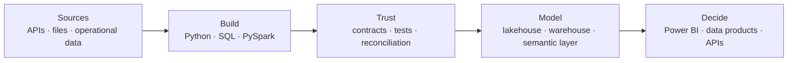

# Mac-Donald Udoye

### Analytics Engineering · Data Engineering · Business Intelligence

I build decision-oriented data products that turn raw, changing data into reliable analytical systems.

SQL · Python · PySpark · Azure Databricks · Delta Lake · Power BI

[LinkedIn](https://www.linkedin.com/in/mac-donald-udoye-940684234/) · [Email](mailto:udoyechidubem@gmail.com)

---

## Current direction

My work connects ingestion and data modelling with the analytical layer people actually use. The focus is not a long tool list; it is traceable data flow, explicit quality controls, explainable design decisions and useful outputs.

## Flagship roadmap

| Project | Purpose | Current state |
|---|---|---|
| **CareerSignal** | European job and skills intelligence: historical vacancy snapshots, ESCO normalisation, demand analytics and a later evidence-backed matching service | Charter / Bronze planning — private |
| **MarketTime** | Point-in-time market data: immutable observations, revisions, late arrivals and trustworthy as-of analytics | Next flagship — local reference implementation preserved |

These projects are published only when their data-source terms, validation evidence, documentation and ownership walkthrough are complete.

## Supporting evidence

| Repository | What it demonstrates | Classification |
|---|---|---|
| [Databricks Pipeline Methods](https://github.com/kelszn/DE_pipeline_methods_with_SQL_SPARK) | Write-method behaviour, replay safety, duplicates and Delta-table validation | Technical learning lab |
| [SQL Data Warehouse](https://github.com/kelszn/DataWareHouse_withSQL) | Bronze/silver/gold warehouse structure, dimensional views and quality checks | Guided implementation |
| [CV Matching Prototype](https://github.com/kelszn/CV_Matching_Project) | Early PySpark parsing and skill-overlap exploration that will inform CareerSignal | Incubator / incomplete |

## Evidence standard

Every featured project must make six things easy to inspect:

1. the problem and intended user;
2. the current implementation—not only the roadmap;
3. the data contract and architecture;
4. validation, replay and reconciliation behaviour;
5. decisions, limitations and attribution; and
6. the exact boundary between personal work, guided learning and AI assistance.

> Employer data, confidential architecture, credentials and unsupported outcomes are never published here.
