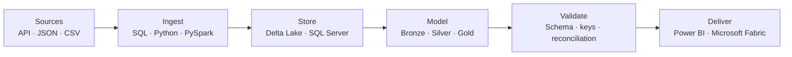

# Mac-Donald Udoye

### Business Intelligence & Data Engineering

SQL · Python · PySpark · Azure Databricks · Delta Lake · Power BI · Microsoft Fabric

[LinkedIn](https://www.linkedin.com/in/mac-donald-udoye-940684234/) · [Email](mailto:udoyechidubem@gmail.com)

---

I build reliable analytics and data-engineering solutions that connect business requirements with implementation. This profile documents selected work across ingestion, transformation, lakehouse modelling, data validation and BI delivery.

## Data systems map

## Technical focus

| Layer | Tools and practices |
|---|---|
| Ingestion | SQL, Python, PySpark, JSON/JSONL, file metadata |
| Transformation | ETL/ELT, Delta tables, append, merge/upsert patterns |
| Architecture | Medallion layers, dimensional modelling, star schemas |
| Quality | Schema checks, uniqueness, referential integrity, reconciliation |
| Analytics | Power BI, Power Query, DAX, Microsoft Fabric |

## Selected repositories

| Repository | Technical evidence | Maturity |
|---|---|---|
| [Data Engineering Pipeline Methods](https://github.com/kelszn/DE_pipeline_methods_with_SQL_SPARK) | Compares `INSERT INTO`, `COPY INTO` and DataFrame append behaviour in Databricks, including replay and duplicate checks | Active learning lab |
| [SQL Data Warehouse](https://github.com/kelszn/DataWareHouse_withSQL) | Guided SQL Server implementation with bronze/silver/gold layers, stored procedures, star-schema views and quality checks | Guided implementation |
| [CV Matching Pipeline](https://github.com/kelszn/CV_Matching_Project) | PySpark prototype for messy-file parsing, skill extraction and profile-to-job overlap | Prototype — incomplete |

## Build standards

Every featured repository should make five things easy to verify: the problem, data flow, implementation decisions, validation approach and current limitations.

> No employer data, internal screenshots, credentials or confidential architecture are published here.
