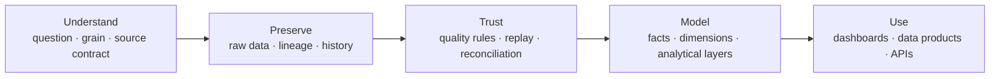

# Mac-Donald Udoye

### Analytics Engineering · Data Engineering · Business Intelligence

I build analytical systems that make changing data easier to trust, understand and use for decisions.

Data modelling · Reliable pipelines · Data quality and reconciliation · Analytical products

[LinkedIn](https://www.linkedin.com/in/mac-donald-udoye-940684234/) · [Email](mailto:udoyechidubem@gmail.com)

---

## Current direction

My work sits between the source data and the decision someone needs to make. I think about what one row represents, how a record should be identified, what happens when a load runs twice, and how the final model can be checked against its source.

That means I focus on:

- defining grain, business keys and source contracts before building transformations;
- preserving raw arrivals while creating clean current and historical views;
- making replay, duplicates, late data and corrections explicit;
- reconciling outputs so a dashboard or analytical product can be trusted; and
- documenting the decisions and limits in plain language.

## Flagship roadmap

| Project | Purpose | Current state |
|---|---|---|
| **CareerSignal** | A Germany-first job and skills intelligence product built around historical vacancy snapshots, skill normalisation and evidence-based career decisions | Charter and Bronze design — private |
| **MarketTime** | A point-in-time market data platform designed to preserve what was known when, including revisions and late arrivals | Next flagship — local foundation in progress |

These projects are published only when their data-source terms, validation evidence, documentation and ownership walkthrough are complete.

## Supporting evidence

| Repository | What it demonstrates | Classification |
|---|---|---|
| [Databricks Write Patterns](https://github.com/kelszn/databricks-write-patterns-lab) | The difference between transport and write behaviour, including append, file-level idempotency, duplicate identity and Delta-table history | Technical learning lab |
| [SQL Warehouse Course Lab](https://github.com/kelszn/sql-warehouse-course-lab) | Source integration, dimensional modelling, referential checks and analytics-ready warehouse views | Guided implementation |

The earlier CV-matching prototype has been archived. Its useful ideas will be reconsidered only inside CareerSignal after the underlying analytical model is trusted.

## Evidence standard

Every featured project must make six things easy to inspect:

1. the problem and intended user;
2. the current implementation not only the roadmap;
3. the data contract and architecture;
4. validation, replay and reconciliation behaviour;
5. decisions, limitations and attribution; 

> Employer data, confidential architecture, credentials and unsupported outcomes are never published here.
